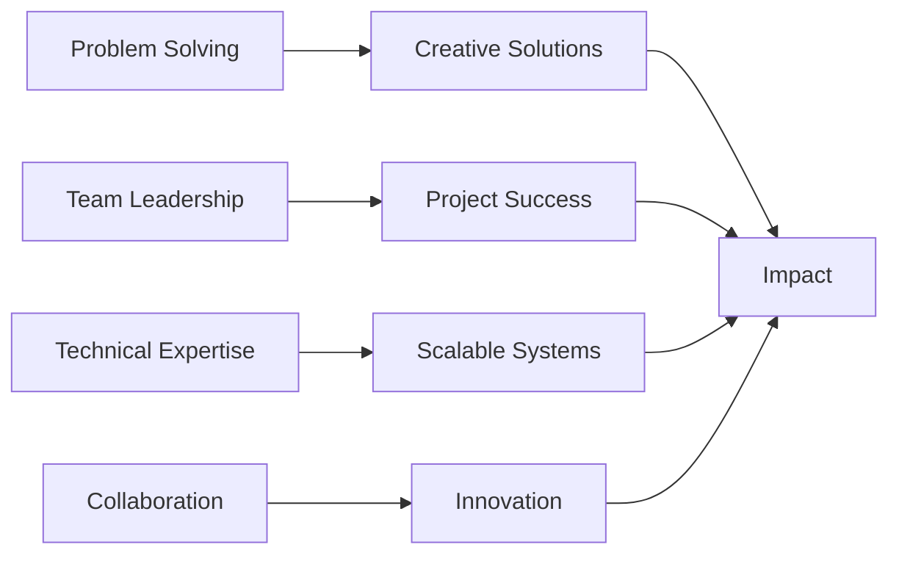

  
  
  
  ### 🚀 Turning Complex Problems into Elegant AI Solutions
  
  *"Code is poetry, AI is the future, and I'm here to write both."*
  

---

## 👨‍💻 About Me

Hey there! I'm Nathan Drake, a **Generative AI Engineer** passionate about pushing the boundaries of what's possible with artificial intelligence. I thrive on solving complex problems, leading teams to success, and building innovative solutions that make a real impact.

When I'm not training models or optimizing pipelines, you'll find me collaborating with cross-functional teams, mentoring fellow developers, or diving deep into the latest AI research. I believe in writing clean, testable code and creating systems that scale beautifully.

**What drives me:**
- 🧠 Exploring the intersection of creativity and machine learning
- 🎯 Delivering production-ready AI solutions that solve real-world problems
- 🤝 Building and leading high-performing engineering teams
- 📚 Continuous learning and staying ahead of the AI curve

---

## 🛠️ Tech Arsenal

### Languages & Core Skills

### AI & Machine Learning

### Development & Tools

### Database & Backend

---

## 🎯 2026 Goals

- 🚀 **Launch** three production-grade generative AI applications
- 📝 **Contribute** to open-source AI/ML projects and frameworks
- 🎓 **Master** advanced LLM fine-tuning and RAG architectures
- 🌟 **Build** a community around ethical AI development
- 💡 **Publish** technical articles sharing insights and best practices
- 🤝 **Mentor** aspiring AI engineers and grow my leadership impact

---

## 💼 Currently Working On

🔥 **Exploring the Frontiers of Generative AI**

I'm currently diving deep into cutting-edge generative AI technologies, experimenting with:
- Building robust LLM-powered applications with advanced prompt engineering
- Developing custom AI agents for automated workflow optimization
- Implementing RAG (Retrieval-Augmented Generation) systems for enterprise use cases
- Fine-tuning open-source models for domain-specific applications

Stay tuned for some exciting projects coming soon! 🎉

---

## 📚 Currently Learning

- 🧪 Advanced reinforcement learning techniques for AI agents
- 🔧 MLOps best practices and model deployment at scale
- 🎨 Multimodal AI models (text, image, audio fusion)
- ⚡ Optimizing inference performance for large language models
- 🛡️ AI safety, alignment, and responsible AI development

---

## 🌟 Superpowers

### Core Competencies

🎯 **Strategic Thinking**
- Problem-Solving | Decision-Making | Project Management

👥 **People & Leadership**
- Team Leadership | Collaboration | Interpersonal Skills

💻 **Technical Excellence**
- Software Development | Unit Testing | Database Management

🎨 **Innovation**
- Creativity | AI/ML Engineering | System Architecture

---

## 🏆 What I Bring to the Table

| 💡 Innovation | 🎯 Execution | 🤝 Collaboration |
|:---:|:---:|:---:|
| Creative problem-solving with cutting-edge AI | Delivering production-ready solutions | Leading cross-functional teams |
| Experimenting with latest GenAI tech | Test-driven development practices | Mentoring and knowledge sharing |
| Architecting scalable systems | End-to-end project ownership | Building strong engineering culture |

---

## 💬 Let's Connect!

  

---

  
### 💭 Thought of the Day
  
*"The best way to predict the future is to build it—especially when you have AI on your side."*

⭐ **If you find my work interesting, let's collaborate and build something amazing together!** ⭐

