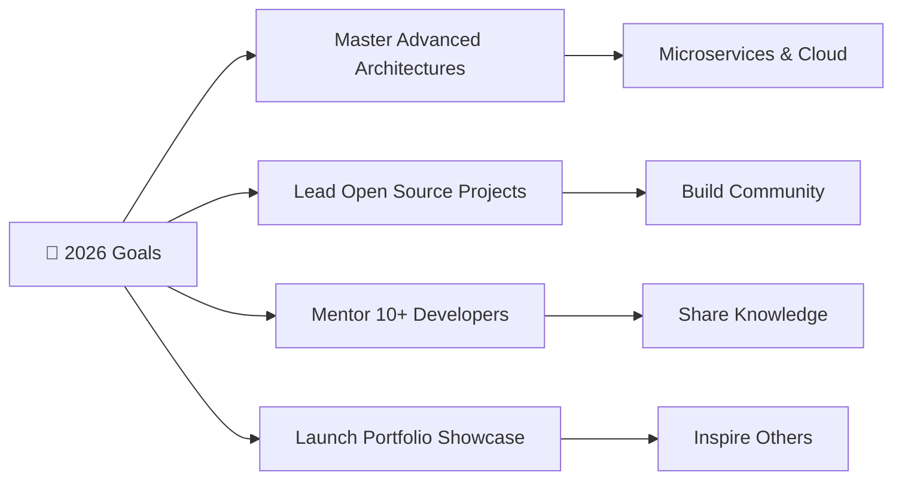
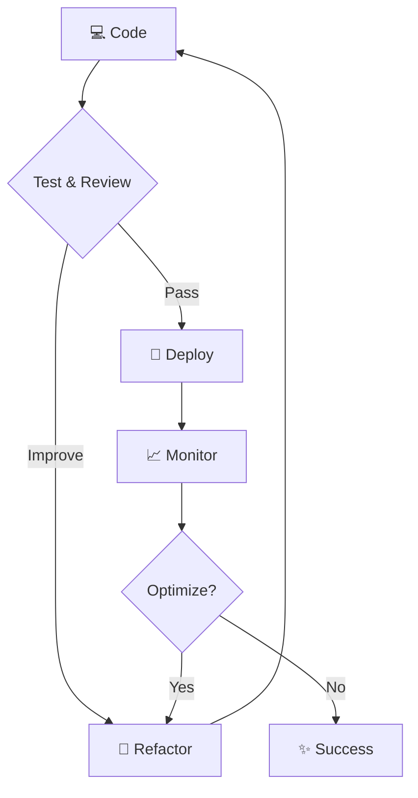

  
  
  
  ### 🗺️ Charting New Territories in Code
  
  *"Sic parvis magna" — Greatness from small beginnings*
  

---

## 🧭 About Me

Hey there! I'm Nathan Drake, a **Software Engineer** who treats every project like an expedition into uncharted territory. Whether I'm architecting scalable systems, leading collaborative teams, or debugging the most elusive bugs, I approach challenges with creativity and determination. I believe the best solutions come from exploring unconventional paths and working together to overcome obstacles.

When I'm not crafting elegant code, you'll find me:
- 🎯 Solving complex problems with innovative approaches
- 🤝 Mentoring team members and fostering collaboration
- 🚀 Exploring new technologies and development methodologies
- 📚 Continuously learning and pushing boundaries

---

## 🛠️ Technical Arsenal

### Languages & Core Skills

### Development Expertise

### Leadership & Soft Skills

---

## 🚀 Currently Working On

🔍 **Exploring New Horizons**

I'm currently charting my course through exciting new projects and challenges. Like any great adventure, the best discoveries are yet to come! I'm focusing on:

- Building robust, scalable applications with Python and Java
- Implementing comprehensive testing strategies for bulletproof code
- Leading collaborative initiatives that bring teams together
- Designing database architectures that stand the test of time

Stay tuned as I document my journey and share the treasures I uncover along the way! 🗺️✨

---

## 🎯 2026 Goals

- 🏗️ **Master advanced software architecture patterns** — Dive deep into microservices, event-driven systems, and cloud-native development
- 🌟 **Launch and lead impactful open-source projects** — Create tools that solve real problems for the developer community
- 👥 **Mentor aspiring developers** — Help others navigate their coding journeys and achieve their goals
- 📱 **Build a comprehensive portfolio** — Showcase projects that demonstrate creativity, technical excellence, and problem-solving prowess
- 🎓 **Expand expertise in emerging technologies** — Stay ahead of the curve with AI/ML integration and modern development practices
- 🤝 **Strengthen collaborative leadership skills** — Foster environments where teams thrive and innovation flourishes

---

## 📊 GitHub Journey

**My Development Philosophy:** *Every commit tells a story. Every PR is a collaboration. Every bug is a lesson.*

---

## 💼 What I Bring to the Table

<table>
  <tr>
    <td align="center" width="33%">
      <h3>🧠 Strategic Thinking</h3>
      
I approach problems holistically, considering both immediate solutions and long-term implications. Decision-making backed by data and experience.

    </td>
    <td align="center" width="33%">
      <h3>🤝 Team Synergy</h3>
      
Strong interpersonal skills and collaborative mindset. I believe the best code is written when diverse perspectives unite toward a common goal.

    </td>
    <td align="center" width="33%">
      <h3>🎨 Creative Solutions</h3>
      
Innovation thrives at the intersection of technical expertise and creative thinking. I find elegant solutions to complex challenges.

    </td>
  </tr>
</table>

---

## 🌱 Currently Learning

The adventure never stops! Right now I'm expanding my horizons with:

- 🐳 **Containerization & Orchestration** — Docker, Kubernetes, and modern DevOps practices
- ☁️ **Cloud Architecture** — Building scalable solutions on AWS, Azure, and GCP
- 🤖 **AI/ML Integration** — Bringing intelligent features into everyday applications
- 🔐 **Security Best Practices** — Writing code that's not just functional, but fortress-strong
- 📊 **Data Engineering** — Turning raw data into actionable insights

---

## 💬 Let's Connect!

  
  
  
  
  

---

  
  ### 💡 "Fortune favors the bold, but preparation favors the successful."
  
  *Let's build something extraordinary together!*
  
  
  

